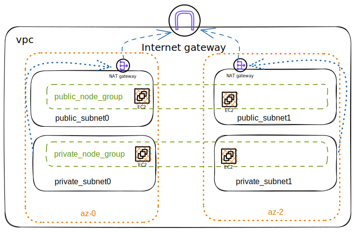

# Overview

In this doc, we will go through two parts of

The homework allows me that deploying a nginx container on a EC2 or a EKS. I choose option 2: building an EKS then deploy a nginx on it.

And I notice that the key of the homework is using terraform.

In the next document, I describe my solution from the following parts:
- Part1 Architecture: describe the desired state of the architecture
- Part2 Implementation:
    - Code Structure Introduce
    - How to Build it
    - Deploy Nginx Controller using Helm

# Part1: Architecture

We assume that the project has a project named: health. Here's the architecture graph, which draw by [Excalidraw](https://excalidraw.com/)



### Network Architecture
I created 6 subnets and they are evenly distributed to 2 Availability Zones. Each availability zone has 3 subnets, one is public subnet, one is private subnet, and one is used to run the database. The public subnet goes out through the Internet gateway and the private sbunet goes out through the NAT gateway.

This is done for security reasons.

# Part2: Implementation

## Code Structure 
> A monorepo is a single repository containing multiple distinct projects, with well-defined relationships.

This is a monorepo. So everything of code in it. It's one of reason we choose Bazel as our build tool.

### Why Monorepo
Many benefits from monorepo as below:
- No overhead to create new projects:Use the existing CI setup, and no need to publish versioned packages if all consumers are in the same repo.
- Atomic commits across projects: Everything works together at every commit. There's no such thing as a breaking change when you fix everything in the same commit.
- One version of everything: No need to worry about incompatibilities because of projects depending on conflicting versions of third party libraries.
- Developer mobility: Get a consistent way of building and testing applications written using different tools and technologies. Developers can confidently contribute to other teams’ applications and verify that their changes are safe.

### Structure Introduce

```shell
% tree -L 5                                                                                                                                                                                                              ✖ ➜ ✹ ✚ ✭
.
├── BUILD.bazel
├── README.md 
├── WORKSPACE # It's a kind of Bazel project's file that to defined external dependencies.  
├── charts # It stores all Helm charts.
│   ├── BUILD.bazel
│   └── nginx-ingress # It's downloaded from Nginx official 
├── doc # It stores all docs in the monorepo. Each subfolder presents a project.
│   ├── BUILD.bazel
│   └── health
│       ├── BUILD.bazel
│       ├── architecture.excalidraw
│       ├── architecture.svg
│       └── terraform-graph.svg
├── docker-compose.yaml #  It's useful on local environment.
├── environments # It stores all the configuration of 3 environments. 
                 # Each environment folder has the same structure, by convention.
│   ├── BUILD.bazel
│   ├── production
│   │   └── BUILD.bazel
│   ├── staging # Store the configuration code of the staging environment for all projects. Each directory represents a project.
                # for more details, we can see it on test folder. 
│   │   ├── BUILD.bazel
│   │   └── health
│   │       ├── BUILD.bazel
│   │       ├── app
│   │       │   ├── BUILD.bazel
│   │       │   └── nginx-ingress.jsonnet
│   │       ├── infra
│   │       │   ├── BUILD.bazel
│   │       │   └── main.tf.jsonnet
│   │       ├── secrets.libsonnet
│   │       ├── secrets.libsonnet.secret
│   │       └── vars.libsonnet
│   ├── template
│   │   ├── BUILD.bazel
│   │   ├── aws # It stores all templates of aws terraform resource. 
│   │   │   ├── BUILD.bazel
│   │   │   ├── eip.libsonnet
│   │   │   ├── eks_cluster.libsonnet
│   │   │   ├── eks_node_group.libsonnet
│   │   │   ├── iam_role.libsonnet
│   │   │   ├── iam_role_policy_attachment.libsonnet
│   │   │   ├── internet_gateway.libsonnet
│   │   │   ├── main.libsonnet
│   │   │   ├── nat_gateway.libsonnet
│   │   │   ├── route_table.libsonnet
│   │   │   ├── route_table_association.libsonnet
│   │   │   ├── subnet.libsonnet
│   │   │   ├── tags.libsonnet
│   │   │   └── vpc.libsonnet
│   │   ├── azure # It stores all templates of azure terraform resource.
│   │   │   └── BUILD.bazel
│   │   └── gcp # It stores all templates of gcp terraform resource.
│   │       └── BUILD.bazel
│   └── test #  Store the configuration code of the test environment for all projects. Each directory represents a project. 
│       ├── BUILD.bazel
│       └── health # health project
│           ├── BUILD.bazel
│           ├── app # applications in health project
│           │   ├── BUILD.bazel
│           │   └── nginx-ingress.jsonnet # the values file, which in json format.
│           ├── infra
│           │   ├── BUILD.bazel
│           │   └── main.tf.jsonnet # terraform main file
│           ├── secrets.libsonnet # It's already ignored by gitignore, here is just a example that storing some secrets in this file. 
│           ├── secrets.libsonnet.secret # It is the file that is encrypted by git-secrets and will eventually be committed to the git repository.
│           └── vars.libsonnet # All variables of this project. The variable in it can be referenced by anywhere.
└── tools   # Store some useful scripts
    ├── BUILD.bazel
    └── delete-vpc.sh
```


### Terraform Graph
We can generate a graph with command: `terraform graph | dot -Tsvg > graph.svg`.


It will be updated before each commit by pre-commit, if you installed pre-commit. 

## How to Build it

### on local development environment
1. install [Bazelisk](https://github.com/bazelbuild/bazelisk)
2. run `bazel test //... && bazel build //...` in root of project

NOTE: You should install pre-commit that to make sure something is ok before you commit.

### on GitHub Actions
We use GitHub Actions as our CI/CD platform. All things of it defined in _.github/workflows_ folder.

## Deploy Nginx Controller using Helm


